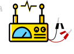



<a class="btn btn-lg btn-primary me-3 mb-4" href="/docs/">
  Learn More <i class="fas fa-arrow-alt-circle-right ms-2"></i>
</a>
<a class="btn btn-lg btn-secondary me-3 mb-4" href="https://github.com/jumpstarter-dev/jumpstarter/releases">
  Download <i class="fab fa-github ms-2 "></i>
</a>

<a class="btn btn-lg btn-secondary me-3 mb-4" href="https://docs.jumpstarter.dev">
  Documentation <i class="fas fa-book ms-2"></i>
</a>

<h2>Enabling Cloud Native Hardware in the Loop for Edge devices &mdash; in the datacenter, lab and development environment!</h2>




{}
Jumpstarter helps you test your software stack in your hardware stack in CI/CD pipelines and streamline your development workflow.
Where traditional cloud software has been testing this way for a long time now, testing
software for edge devices has been a challenge, in many cases <b>emulators for the hardware are not available</b>
, the GPU, the specific sensors, etc.

Jumpstarter helps you test your software in the real hardware, and <b>eliminates the need for manual
test operations</b>.

This is a <b>free and open source</b> project, <b>currently being developed</b> by <a href="https://github.com/NickCao">Nick Cao</a> and <a href="https://github.com/mangelajo">Miguel Ángel Ajo</a> from <a href="https://next.redhat.com">Red Hat ET</a> and <a href="https://github.com/kirkbrauer">Kirk Brauer</a> from <a href="https://hatci.com">Hyundai America Technical Center.</a>

{}

{}
{}
Jumpstarter lets you test your hardware with the power of

<i class="fa-brands fa-python"></i> Python

You can use simple
Python scripts, but you can also write regular python tests with your favorite
testing framework.

{}

{}
 All our source code is hosted in the jumpstarter-dev organization on
 [GitHub](https://github.com/jumpstarter-dev/) contributions are welcome, and you
 can also join our [Community](/community/)
{}

{}
The Jumpstarter project provides a set of drivers to build your perfect test harness,
we aim to support a wide range of hardware and interfaces.

You can use a Raspberry Pi as your test harness, or you can use other SBCs or
comercially available test harnesses.

We also created a USB based test harness, the [DUTLink board](https://github.com/jumpstarter-dev/dutlink-board) which provides storage/power/console/gpio control
over an SBC. Jumpstarter provides a driver for the DUTLink board.
{}

{}

