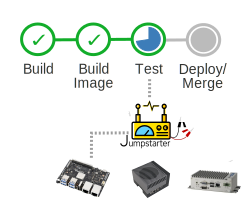

## What is Jumpstarter?

Jumpstarter is a project to enable **Hardware in the Loop** testing and development for Edge devices.

 
 

Embedded and Edge devices have been traditionally tested in a manual way with a human operator.
This is not scalable, and unsuitable for CI/CD pipelines.

In a modern development cycle we want to know that our software changes work well into our
device hardware. We need to test the onboarding process, the software stack, the hardware,
the updates and the interaction between all of them.

{}

With Jumpstarter it's possible to use software CI/CD pipelines like Tekton, GitHub CI,
GitLab CI, Jenkins, etc., as well as integrated development and scientific environments
like Jupyter and Eclipse Che / Devspaces to interact with your physical hardware.

## How does it work?
The distributed mode takes advantage of Kubernetes to support the management of multiple target devices directly from your existing cluster. This allows the utilization of devices for both development and continuous integration.

{}

Jumpstarter also provides a local-only model where kubernetes is not necessary. This is useful for development and testing purposes. More details can be found in the [Docs/How-It-Works](https://docs.jumpstarter.dev/introduction/how-it-works.html)
## Why do I want it?

* I need my software to be tested in real hardware for **every new pull/merge** request to my project.
* I need my software to be tested for **every new release or commit** of my project.
* I want my software to be automatically tested in newer versions of the hardware.
* I have **multiple variants of the hardware where my software needs to run**, and I want to test in them all.
* I want a **hands-free operation** of hardware in my **development environment**,
  i.e. I don't want to manually flash images, reboot the DUT, insert usb sticks, manually
  interact with a bootloader, etc.
* I want to create a lab where developers can **run and test their software in real hardware**.

* **What is it good for?**: Integrating your hardware edge devices into your software CI/CD pipeline. Creating a distributed lab for your developers to test their software in real hardware.

* **What is it not good for?**: Managing edge devices. Jumpstarter is not a device management tool, it is a testing and development tool.

## Where should I go next?

* [Getting Started](/docs/Getting%20started/)

